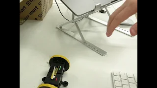

<<<<<<< HEAD
# BrnoProject

Team number: 4  
Team name: Brnology  
Contact:  
   -Kim Kyumin (lemon6565@naver.com)  
   -Cho Junhee  (jjhjjh1159@kyonggi.ac.kr)  
   -Elvis Juma (elvis.juma@strathmore.edu)  
   -KimHyoeun (dhy04029@gmail.com)  
   
Topic: Face recognition for improving online class concentration  
Description of the projects:  
With the arrival of Covid-19, students participate in classes not face-to-face but using programs such as Zoom and Google Meet. However, because they are not face-to-face with professors, it is not easy to check how concentrated students are. To increase their concentration, our team is going to encourage students to look at the screen directly using image detection.Because we plan to recognize students' faces through real-time images, learning will be conducted using webcams.The purpose of this project is to check the concentration of certain students who are participate in class. That is why we use team members’ faces as a dataset. By using this technology, it is expected that students will be able to create a high-quality class atmosphere by increasing their concentration.
=======
# Hand Gesture Recognition

Deep learning based hand gesture recognition using LSTM and MediaPipie.

[Demo video using PingPong Robot](https://youtu.be/g16KvSEq0XU)

## Files

Pretrained model in *models* directory.

**create_dataset.py**

Collect dataset from webcam.

**train.ipynp**

Create and train the model using collected dataset.

**test.py**

Test the model using webcam or video.

**robot.py**

Gesture control using PingPong Robot.

## Dependency

- Python 3

- TensorFlow 2.4

- sklearn

- numpy

- OpenCV

- MediaPipe
>>>>>>> f400c63c23150b22b4f59dc6cce705d65b30317c
